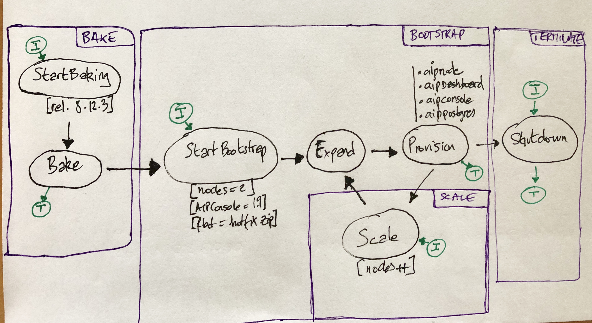

# AIP on demand AWS enabler

Ready to go AIP platform on AWS.

## Features

This set up comprises:

* AIPConsole
* CAST AIP
* Dashboard
* Postgres RDBMS
* CAST AIP nodes can scale out once the platform is spawed.

**Note: The Postgres instance is shared by all components.**

### Primary use case - platform with 2 AIP nodes, within minutes

1. Spawn a platform with 2 CAST AIP nodes in a given subnet in AWS, within minutes.
2. Run projects analysis (manual)
3. Grab results (manual)
4. destroy platform

### Future use cases ?

Upload zip of source files to be analyzed through an AIPConsole endpoint and push the result (a Postgres dump?) to AWS s3.

## Requirements

### Get AWS Credentials

* AWS ceredential tokens 
* Permissions:

  * Launch ec2 instances.
  * Create security groups 
  * RW access to a given s3 bucket.

* A VPC subnet id with its CIDR specification. (REVIEW: hardcoded 172.31.64.0/20)

### Upload CAST Artifacts to a s3 bucket

#### Some links to CAST Artifacts

* CAST_AIP:
https://doc.castsoftware.com/display/DOC83/Installing+CAST+AIP
https://confluence.castsoftware.com/display/download/AIP+8.3+Product+Center
//Productfs01/EngBuild/Releases/

* AIP_console:
https://extendng.castsoftware.com/#/extension?id=com.castsoftware.aip.console&version=1.14.2-funcrel

* Framework Detector
//Productfs01/EngBuild/Releases/FrameworkDetector


#### Files to upload to S3

* AIP release: CAST_AIP_xxx.zip
* AIPConsole release: AIP-Console-xxx.zip(>1.9 with the CAST-RESTAPI-integrated.war)
* Framework detector
* CMSAPI source tarball
* AIP flat:  x.y.zz_Buildnnnn_flat.zip (optional flat build to patch the release)

To upload those files, it is recommended to install the [aws cli](https://docs.aws.amazon.com/cli/index.html).

It is much faster and less error-prone than through the web console.

```bash
aws s3 cp  <path to zip> s3://<bucket>
```

#### Patching AIP-Console-xxx.zip

Extract the zip, then extact the CAST-RESTAPI-integrated.war

* Patch the file WEB-INF/domains.properties with the line:

  ```
  AAD=Resource1,general_measure
  ```

  Explanation:

  There is a context parameter entry in the web.xml for *domains-location*, which is 
  used as virtual path under the servlet context and cannot be overridden with an external path.

## Configuration

### AWS credentials, region and role  in `~/.aws-env` and `~/.aws-region`

Create a ~/.aws-env file with AWS credentials:

```bash
AWS_ACCESS_KEY_ID=
AWS_SECRET_ACCESS_KEY=
```

In case you're using a control instance on AWS (see bellow), add a line with the IAM role for the instance.

This role must have the same set of permissions as the user specified with AWS tokens above.

``` bash
AWS_IAM_ROLE=<role>
```

Create a ~/.aws-region file with the AWS region to operate (us-east-1 or similar):

```bash
AWS_DEFAULT_REGION=
```

### AIP environment variables to set in ~/.aip_aws

```bash
# Windows Admin password
WIN_ADMIN_PASSWORD=DansmaBenzBenzBenz123!
# Public key for ssh connection on linux instances
PUBLIC_KEY=~/.ssh/aip.pub
# AWS s3 bucket where artifacts are stored
s3_BUCKET=casthighlight-ci
# API release version
CAST_AIP_VERSION=8.3.12.1966
# Patch with this flat if not commented
CAST_FLAT_AIP_ZIP=8.3.12_Build1958_flat.zip
# AIPConsole release version and build number
CAST_AIP_CONSOLE_VERSION=1.9.0
CAST_AIP_CONSOLE_BUILD_NUMBER=1237
```
You can also export those variables in the current shell session instead.

## Usage

### SSH agent

Linux machines share the same installed public key for authentication ( see `PUBLIC_KEY` in bellow )

Use ssh with agent forwarding if you choose to bounce on the ansible controller machine in AWS.


#### Set up SSH-AGENT

Start an agent:
```
eval "$(ssh-agent)"
```

Add the private key (the peer key of the one set in PUBLIC_KEY):
```
ssh-add /path/to/key
```

Now when using a control machine to operate in AWS, enable  ssh forwarding with the `-A` switch:

```
ssh -A -o StrictHostKeyChecking=no admin@<contol-node> 'command'
```

From now on the full command with the ssh is not always specified. Should be clear in the context.

### Optional (highly recommended) controller VM - ./aws_aip-control.sh

Creates an EC2 instance to assume the Ansible control node role:

```
./aws_aip-control.sh
```

This is optional, but it is much faster to run inside AWS.
It also validates the install from scratch of a control machine.

If not using the AWS control node, install the requirements locally with `install_ansible_requirements.sh`

#### No IAM role? copy the AWS User's credentials to the control machine ( not recommended )

If you don't have a IAM role available, you must copy the AWS User tokens to control instance:

```
scp ~/.aws-env admin@ec2-XXXXX.compute-1.amazonaws.com:~
```

This is a security issue and is not recomended.

### Big picture



### Bake the CAIP Windows node - `./aws_aip-bake.sh`

Since the install of CAIP takes forever, 
the purpose of baking an image with the CAIP release installed is to reduce the setup duration of nodes.

The setup of each node may require the application of the _flat_ patch and the install of the AIPConsole for api access.

#### What it does?

Starts a Windows (ami-0410d3d3bd6d555f4) and install CAIP from s3.

Upon successful installation of CAIP an AMI image with the same version is created for AIP nodes VMs.

### One shot bootstrap - `./bootstrap.sh`

```
time ssh -A -o StrictHostKeyChecking=no admin@ec2-100-25-150-6.compute-1.amazonaws.com ./bootstrap.sh
```

#### What it does?

##### Expand - `./aws_aip-expand.sh`

Creates the platform (VMs + Network configuration) to host AIP related artifacts.

The VMs to launch are of different types (ami, instance size)

aippostgres (deb strech, t2.micro)
aipnode (previously basked win2019, t2.small)
aipconsole (deb strech, t2.micro)

Expansion launches a given number of machines for each type:

1 aippostgres
2 aipnode
1 aipconsole

##### Provision- `./aws_aip-postgres.sh && ./aws_aip-node.sh && && ./aws_aip-dashboard.sh ./aws_aip-console.sh`

Initialize the VMs, given its type.

###### aippostgres
Installs postgres and the required roles for aip nodes.
Restore the dump to use with dashboard

###### aipnode
Installs the aip api and fetches the created tokens

###### aipdashboard 
Intalls the aip war to use with the console.

###### aipconsole
Installs the aip console and configure known aip nodes and dashboard integration.


#### How to connecto to AIP console?

Once the above is finished, the ui is available at:

```
http://<ec2-aip-console-public-dns>:8081/ui/index.html
```

The ec2-aip-console-public-dns can be retreived with:

```
 ./aws_inventory.sh --graph aip_console_hosts
```

### Scale AIP nodes

```
./aws_aip-scale.sh 4
```

#### What it does?

* adjust total aip node count
* expand
* provision aip nodes
* update the console

##### expand

Lauch the new EC2 instances with the baked image.

##### provision

Only newly expanded node are provisoned and the generated tokens are fetched.

##### update the console 

Registers new nodes with tokens with the AIPConsole

**Note:**

The API for node management in AIPConsole should accept nodes in disabled state

As a workaround, the AIPConsole h2 db is directly injected with such configuration.

### Removing nodes - TODO
### Platform temination - TODO

## Things to improve

### AIPConsole node management: accept disabled nodes 

* Node management api should not check node availability by default.
  The AIPConsole is not stable with the current update method of the node list
  (direct sql insert) -> the console must be restarted

### Dashboard: domains-location used as virtual path for the context

* Manage an external configuration to initialize domains.properties

